<a name="readme-top"></a>

<!-- PROJECT LOGO -->
<br />
<div align="center">
  <a href="https://github.com/Adam-Gladstone/Office365AddIns">
    
  </a>

  <h3 align="center">Office365 AddIns</h3>
  
  <h4 align="center">ExcelRAddin for Excel</h4>
  <h4 align="center">RScriptAddin for Word</h4>

  <p align="center">
    <br />
    <a href="https://github.com/Adam-Gladstone/Office365AddIns"><strong>Explore the docs »</strong></a>
    <br />
    <br />
    <a href="https://github.com/Adam-Gladstone/Office365AddIns/issues">Report Bug</a>
    ·
    <a href="https://github.com/Adam-Gladstone/Office365AddIns/issues">Request Feature</a>
  </p>
</div>

<!-- TABLE OF CONTENTS -->
<details>
  <summary>Table of Contents</summary>
  <ol>
    <li>
      <a href="#about-the-project">About The Project</a>
      <ul>
        <li><a href="#projects">Projects</a></li>      
        <li><a href="#built-with">Built With</a></li>
      </ul>
    </li>
    <li>
      <a href="#getting-started">Getting Started</a>
      <ul>
        <li><a href="#prerequisites">Prerequisites</a></li>
        <li><a href="#installation">Installation</a></li>
      </ul>
    </li>
    <li><a href="#usage">Usage</a></li>
	  <li><a href="#latest-updates">Latest Updates</a></li>
    <li><a href="#roadmap">Roadmap</a></li>
    <li><a href="#license">License</a></li>
    <li><a href="#contact">Contact</a></li>
    <li><a href="#acknowledgments">Acknowledgments</a></li>
  </ol>
</details>

<!-- ABOUT THE PROJECT -->
## About The Project
The _Office365 AddIns_ solution consists of two main projects. The ExcelRAddIn project and the RScriptAddIn project. The intention of both projects is quite similar: that is, to make R functionality available in the respective Office applications, Excel and Word.

So, what do these add-ins actually do?
* The ExcelRAddIn allows you to execute R code and get the results back in Excel. This behaves similarly to executing R code in RStudio's Console window. The following is a snapshot after fitting a simple linear model.

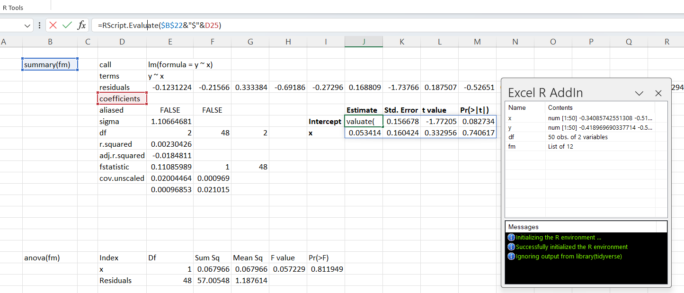

* The RScriptAddIn (for Word) allows you to write text and R code in the same document, execute the R code and use the results (if there are any) 'inline'.  The following screenshot shows creating a contour plot from a simple function.

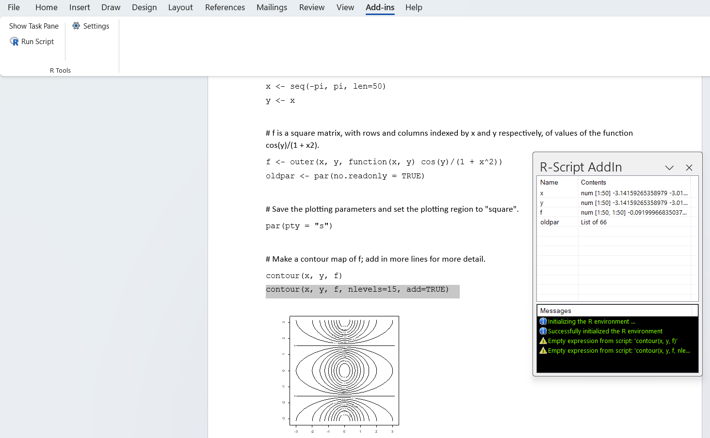

<p align="right">(<a href="#readme-top">back to top</a>)</p>

### Projects
The Office365AddIns solution consists of a number of projects detailed below. The projects are all 'Alpha' versions and are in the early stages of development. 

The ExcelRAddIn is an Excel-DNA add-in (see below), and the RScriptAddIn is a Word VSTO add-in. Both add-ins make use of the fantastic <a href="https://github.com/rdotnet/rdotnet">R.NET</a> library (alongside the DynamicInterop library) to access R functionality. This is encapsulated in the RDotNetProxy project. There is a separate NUnit unit test project for this component. A further project, the REnvironmentControlLibrary, provides a simple list view of the objects in the current R environment and a place to display any informational or error messages. The ExcelRAddIn additionally makes use of the amazing <a href="https://excel-dna.net/">Excel-DNA</a> library.

Details:
* RDotNetProxy - a wrapper around the R.NET library. This deals with presenting the output from R (via R.NET) in a form that is usable in Excel or Word (depending on which add-in is being used).
* RDotNetProxyTest - an NUnit unit test library.
* REnvironmentControlLibrary - a Windows Forms control that contains a list view for displaying objects in the current global R environment and a list view of information and error messages.
* ExcelRAddIn - an Excel-DNA add-in.
* RScriptAddIn - an Office VSTO (C#) add-in.

### Built With
The solution is built with:
* Visual Studio Community Edition 2022

The following packages are used:
* Excel-DNA (ExcelDna.AddIn 1.6.0): <a href="https://excel-dna.net/">Excel-DNA</a>
* R.NET 1.9.0: <a href="https://github.com/rdotnet/rdotnet">R.NET</a>
* DynamicInterop 0.9.1

<p align="right">(<a href="#readme-top">back to top</a>)</p>

<!-- GETTING STARTED -->
## Getting Started
_Downloading_

The project can be downloaded from the GitHub repository in the usual way. 

_Building the solution_

Ensure that the references (R.NET, DynamicInterop and Excel-DNA) are present in their respective projects. When the project is opened in Visual Studio, NuGet should restore the packages. If not, you may need to add the packages manually to the solution/projects. You can (re)build either the Debug or Release versions.

At this point the projects can be run under the debugger in the usual way. More detailed installation instructions are given below.

### Prerequisites
* Office365 Microsoft Word
* Office365 Microsoft Excel
* R (a recent version e.g. 4.3.0, 4.3.1)

NOTE: The add-in depends on R. Please make sure that R is installed first. 
The default config file has the following additional libraries listed:
	tidyverse, dplyr, forecast, ggplot2, ggthemes
If you do not need these, you should remove them (otherwise you will see some error messages indicating that the named package was not found).

### Installation

#### Installation can be done in two ways:
- Building the Office365AddIns project from scratch. 
- Installing (copying) the 'Publish' directory to where you want to run the add-in from.

#### Building the ExcelRAddIn from scratch
1. After building the add-ins, copy the bin\Debug or bin\Release contents to a new directory.
2. Start Excel. Open the file ExcelRAddIn-AddIn64.xll. Excel will ask if this add-in should be enabled for this session. Press 'Enable'. The add-in is loaded, and a new menu appears on the right-hand side of the menu bar: R AddIn.
3. Select the R AddIn menu. A ribbon bar is displayed with two buttons. Show/Hide Task Pane and Settings. 
4. Select the Settings. An R Environment Settings dialog box is displayed. Fill in the details for the R Home and the R Path. R Home is where the base R installation lives. R Path is the directory where the R.dll lives. Press OK. Note you can also edit these settings manually in the configuration file ExcelRAddIn-AddIn64.xll.config.
5. Finally, for convenience, it is useful to 'Trust' the AddIn location as this will ensure that Excel does not prompt you regarding a potential security concern each time the add-in is loaded. To do this, select the File menu, then Options. The Excel Options dialog box is displayed. Select Trust Center and press the button Trust Center Settings... . The Trust Center dialog is displayed. Use the Add New Location button to add the AddIns location to the list of trusted locations. Press OK when complete. Press OK to close the Excel Settings dialog.
6. Open a new blank sheet. In cell B2 type: ```x <- rnorm(15)```. Next to this, in cell C2, type: ```=RScript.Evaluate(B2)```. The task pane will open. In the lower third, where the Messages are displayed there should be two informational messages indicating that R has been initialized correctly. In the Environment list view you should see the results of evaluating the R script. In the cell C2, the value ```x``` should appear. The following screenshot shows the sample session:

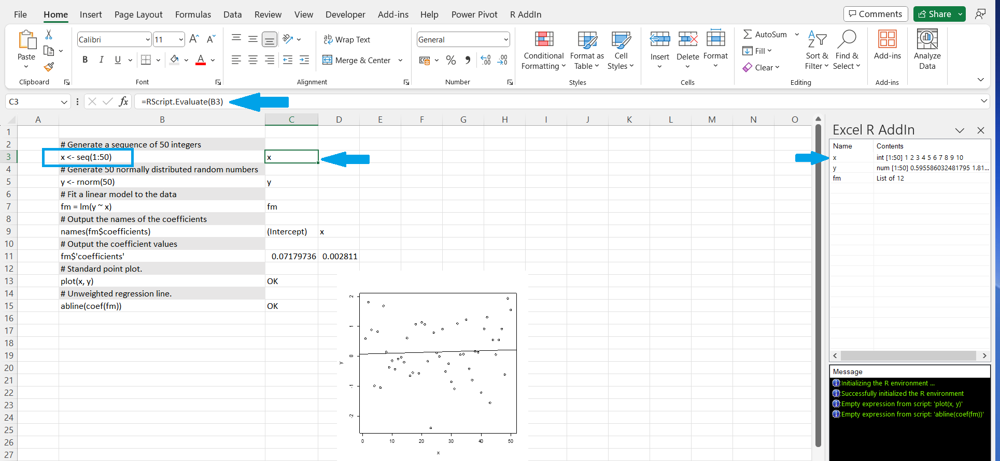

#### Installing from the __Publish__ directory
1. From https://github.com/Adam-Gladstone/Office365AddIns, select Code > Download ZIP.
2. Extract the files in Office365AddIns-master.zip to a directory of your choice.
3. (Optional) Right-click the Office365AddIns-master.zip, select Properties and check the 'Unblock' box.
4. Open the zip file and copy the \Publish directory to where you want to run the add-in from. The \Publish directory contains the ExcelRAddIn and the RScriptAddIn binaries.
5. Under \Publish in the ExcelRAddIn directory, locate the file ExcelRAddIn-AddIn64.xll.

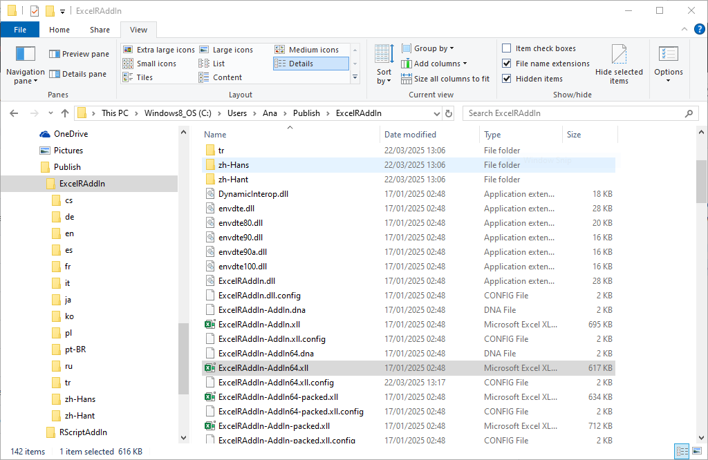

6. Double-click the file to open in Excel (assuming the .xll extension is associated with Excel).
The first time you run this you will see a security warning. Press the button with 'Enable this add-in for this session only'. 
7. The add-in is loaded, and a new menu appears on the right-hand side of the menu bar: R AddIn.
8. Open a new blank workbook.
9. Select the R AddIn menu. A ribbon bar is displayed with three buttons. Show/Hide Task Pane, Create Plot and Settings.
Select the Settings. An R Environment Settings dialog box is displayed. Fill in the details for the R Home and the R Path. R Home is where the base R installation lives. R Path is the directory where the R.dll lives. In the list of packages, you may want to add (or remove) some default packages: e.g. tidyverse, ggplot2 etc. Once you have finished configuring the R environment, press OK.

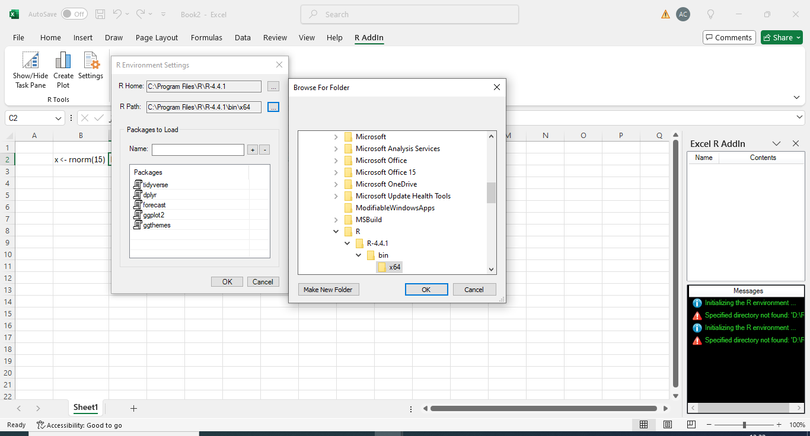

Note you can also edit these settings manually in the configuration file ExcelRAddIn-AddIn64.xll.config.

10. Finally, for convenience, it is useful to 'trust' the AddIn location as this will ensure that Excel does not prompt you regarding a potential security concern each time the add-in is loaded. To do this, select the File menu, then Options. The Excel Options dialog box is displayed. Select Trust Center and press the button Trust Center Settings... . The Trust Center dialog is displayed. Select Trusted Locations. Use the Add New Location button to add the AddIns location to the list of trusted locations. Press OK when complete. Press OK to close the Excel Settings dialog.
11. Open a new blank sheet if you haven't already done so.
12. In cell B2 type: ```x <- rnorm(15)```
13. Next to this, in cell C2, type: ```=RScript.Evaluate(B2)```
The task pane will open. In the lower third, where the Messages are displayed there should be two informational messages indicating that R has been initialized correctly. In the Environment list view you should see the results of evaluating the R script. In the cell C2, the value 'x' should appear.

#### Troubleshooting
I have had an installation where it complained that 'rnorm' could not be found. The default 'stats' package functions fail to load. To remedy this:
Type in cell B2: ```library("stats")```.
In the cell next to this type: ```=RScript.Evaluate(B2, TRUE)```. The second argument is just to ignore the output (which in this case is a list of loaded packages). This should return OK. Then evaluate ```x <- rnorm(15)```.

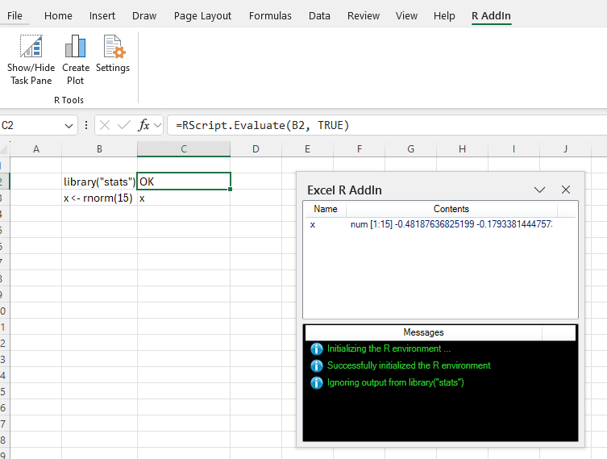


#### RScriptAddIn
1. Copy the bin\Debug or bin\Release contents to a new directory. Confirm that in the directory there is a file called RScriptAddIn.vsto. This is the deployment file. 
2. Double-click this file to install the add-in.
3. Start Word, open a blank document. In the menu bar there is an Add-ins menu. Select this and in the ribbon bar you should see the R Tools menu. This consists of a button to Show and Hide the Task Pane, a button to execute R script, and a settings button. Press the Settings button. An R Environment Settings dialog box is displayed. Fill in the details for the R Home and the R Path. R Home is where the base R installation lives. R Path is the directory where the R.dll lives. Press OK.
4. Open the document "RScriptAddIn/Tests/AddIn Test.docx". Select the line 'x <- seq(1:50)'. On the Add-ins menu, press the button Run Script. The task pane will open (if it is not already visible). In the lower third, where the Messages are displayed there should be two informational messages indicating that R has been initialized correctly. In the Environment list view you should see the results of evaluating the R script. Continue executing the script. The following screenshot shows the sample session:

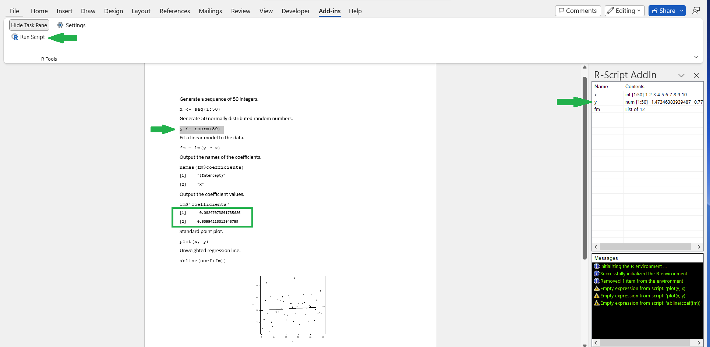

<p align="right">(<a href="#readme-top">back to top</a>)</p>

<!-- USAGE EXAMPLES -->
## Usage
Both the ExcelRAddIn and the RScriptAddIn projects have /Tests subdirectories. These contain a number of usage examples.

<p align="right">(<a href="#readme-top">back to top</a>)</p>

<!-- Latest Updates -->
## Latest Updates
These are the latest updates from 14/11/2024.

### Create plot button
- The new Create plot button allows you to generate the script required for outputting a ggplot (https://ggplot2.tidyverse.org/) graph.

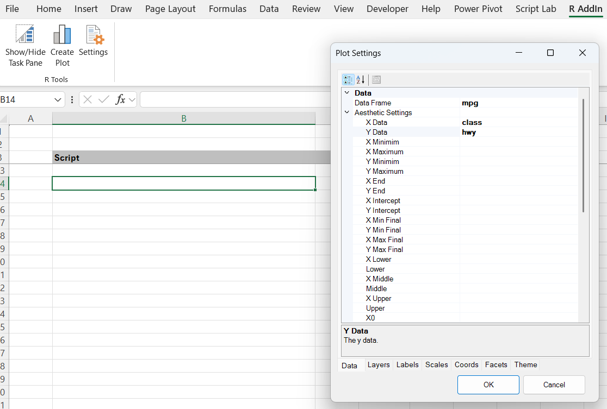

The inputs are divided into Data, Layers, Labels, Scales, Coords, Facets, and Theme. These correspond to the major parts of a ggplot.

The Data page allows you to select the data and set the aesthetic for the plot.

The Layers page allows you to set the specifics of the chart type: the geom. After adding a geom, double clicking the label takes you to further attribute settings appropriate to the specific geom.

The Theme page allows you to select a theme.

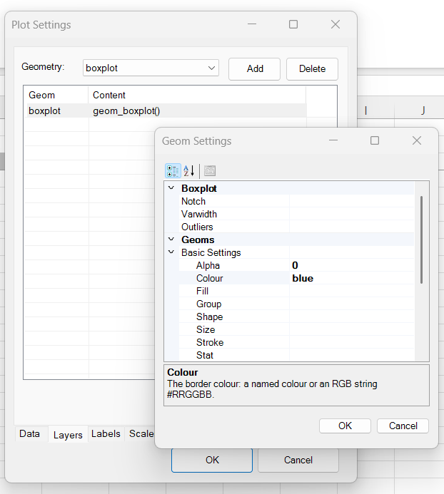

Once complete, the script is output, wrapped in a `plot(...)` function. This can be evaluated using `RScript.Evaluate()`. The resulting plot can be copied as a metafile and saved in the worksheet.

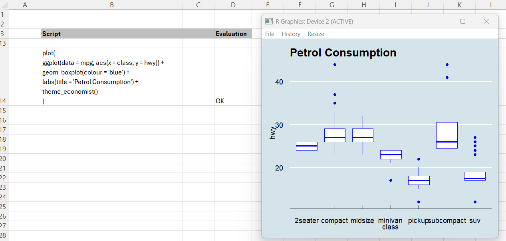

- Minor UI updates to the panel.
- Added a directory 'Publish' that contains the binaries.

These are the updates from 27/04/2024
### Ease of use features.
- Users can specify packages to load when the add-in is initialised in the Add-In settings available from the R AddIn menu.

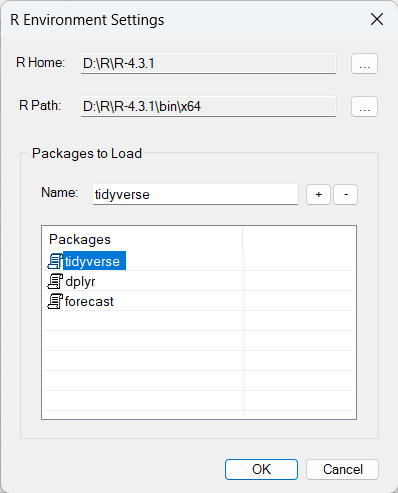

Default package loading takes place on the first call to `RScript.Evaluate(...)`.

- Updates to `CreateVector`, `CreateMatrix`, `CreateDataFrame`. The final parameter ('Type' => character, complex, integer, logical, numeric) is now optional; the RType is now determined from the data if possible. This makes it somewhat easier to create objects to pass to R from Excel. 
- Two generic calls have been added: `RScript.Params` and `RScript.Function`. `RScript.Params` returns a list of parameters for the requested function and `RScript.Function` evaluates the specified function, possibly using the parameter dictionary retrieved from the call to `RScript.Params`.

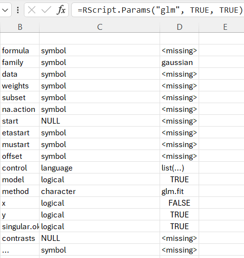

- Additional functions for querying models (objects returned from calls to 'lm', 'glm' etc): 
	`Model.Results` outputs a list of results from the model. 
	`Model.Result` outputs the result obtained from one item of the list of model results. Optionally, the result can be formatted as a data frame. This is somewhat more convenient than having to evaluate scripts of the form `'model name'$coeffcients`, etc.
	`Model.Accuracy` returns a number of statistics relating to measures of model accuracy.

### Wrapper functions.
One of the motivations for updating the __ExcelRAddIn__ was to provide an improved experience when using more complex R functions in an Excel worksheet. The idea was to avoid building up a script by providing wrapper functions that can handle the variety of parameters passed to the underlying R functions. The option of using a script is always available. However, for a complex function like `auto.arima` (which can take up to 35 parameters) or `glm`, it is easier to setup a parameter dictionary with the appropriately named parameters and their values (as shown below)

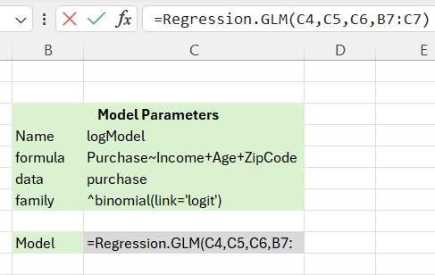 

rather than creating a script, for example: `logModel = glm(Purchase~Income+Age+ZipCode, data = purchase, family = binomial(link='logit'))`

The parameters and their default values can be retrieved by using the `RScript.Params` function.

Wrapper functions have been provided for a number of the functions in the forecast library (https://cran.r-project.org/web/packages/forecast/forecast.pdf). 
These are as follows:
* Forecast.MA			- Moving average smoothing
* Forecast.SES		- Simple exponential smoothing
* Forecast.Holt		- Holt exponential smoothing
* Forecast.HW			- Holt-Winters exponential smoothing.
* Forecast.AutoETS	- Exponential smoothing state space model.
* Forecast.Arima		- Auto-Regressive Integrated Moving Average model
* Forecast.AutoArima	- Fit best ARIMA model to univariate time series
* Forecast.FC			- Generic function for forecasting from time series or time series models
* Forecast.meanf		- Mean forecast
* Forecast.rwf		- Forecasts and prediction intervals for a random walk with drift model
* Forecast.splinef	- Local linear forecasts and prediction intervals using cubic smoothing splines
* Forecast.thetaf		- Forecasts and prediction intervals for a theta method forecast
* Forecast.Croston	- Forecasts and other information for Croston’s forecasts

In addition to the wrappers around the forecast package, wrappers have been provided around the following two 'workhorse' functions:
* Regression.LM		- Fit a linear model to the data
* Regression.GLM		- Fit a generalised linear model to the data

The Forecast.xlsx spreadsheet provides examples of these based on the underlying packages.

### UI updates
- The R Environment AddIn panel has been updated to use WPF (in place of Windows Forms). This allows greater flexibility (at least in theory) for future enhancements.


<p align="right">(<a href="#readme-top">back to top</a>)</p>

<!-- ROADMAP -->
## Roadmap

Future directions:
- [ ] Add Changelog

See the [open issues](https://github.com/Adam-Gladstone/Office365AddIns/issues) for a full list of proposed features (and known issues).

<p align="right">(<a href="#readme-top">back to top</a>)</p>

<!-- LICENSE -->
## License

Distributed under the GPL-3.0 License. See `LICENSE.md` for more information.

<p align="right">(<a href="#readme-top">back to top</a>)</p>

<!-- CONTACT -->
## Contact

Adam Gladstone - (https://www.linkedin.com/in/adam-gladstone-b6458b156/)

Project Link: [https://github.com/Adam-Gladstone/Office365AddIns](https://github.com/Adam-Gladstone/Office365AddIns)

<p align="right">(<a href="#readme-top">back to top</a>)</p>

<!-- ACKNOWLEDGMENTS -->
## Acknowledgments

Helpful resources

* [Choose an Open Source License](https://choosealicense.com)
* [GitHub Pages](https://pages.github.com)
* [Font Awesome](https://fontawesome.com)
* [React Icons](https://react-icons.github.io/react-icons/search)

<p align="right">(<a href="#readme-top">back to top</a>)</p>

<!-- PROJECT SHIELDS -->
[![GPL-3 License][license-shield]][license-url]
[![LinkedIn][linkedin-shield]][linkedin-url]

<!-- MARKDOWN LINKS & IMAGES -->
<!-- https://www.markdownguide.org/basic-syntax/#reference-style-links -->

[license-shield]: https://img.shields.io/github/license/Adam-Gladstone/Office365AddIns.svg?style=for-the-badge
[license-url]: https://github.com/Adam-Gladstone/Office365AddIns/blob/master/LICENSE.md

[linkedin-shield]: https://img.shields.io/badge/-LinkedIn-black.svg?style=for-the-badge&logo=linkedin&colorB=555
[linkedin-url]: https://www.linkedin.com/in/adam-gladstone-b6458b156/
